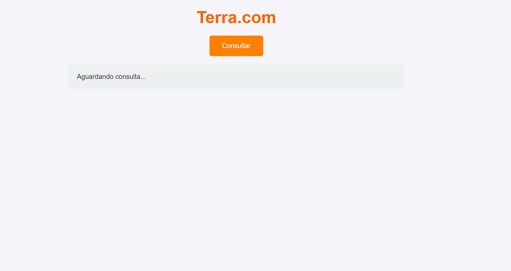
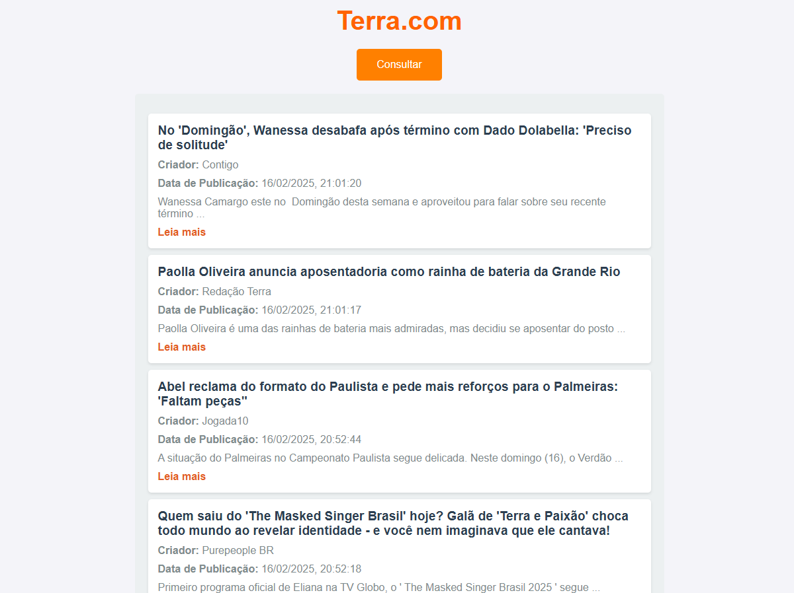

<div align="justify">

# API em Node.js para Extração e Armazenamento de Dados de Feeds RSS do Terra.com 

# 📖 Visão Geral 
Este projeto foi desenvolvido como parte da avaliação das **Sprints 2 e 3** do programa de bolsas **Compass UOL**, focado na formação em **Inteligência Artificial para AWS**.

O principal objetivo foi criar uma **API em Node.js** utilizando o framework **Express**, dockerizada e hospedada em um **IP público na AWS**, capaz de armazenar e disponibilizar dados extraídos de um feed **RSS** do site [Terra.com](https://www.terra.com.br/).

# 🌍🔗 Como Acessar a Aplicação? 

#### A aplicação está disponível no seguinte IP público: http://54.90.160.105:4000/

# ✅ Funcionalidades Implementadas

### Este projeto consiste em uma API que oferece as seguintes funcionalidades:

#### 1. Extração de Conteúdo RSS

* Coleta dados de um feed RSS do site público [Terra.com](https://www.terra.com.br/).

* Processa e estrutura os dados para uso na aplicação.

#### 2. Armazenamento dos Dados

* Armazena os dados extraídos em um arquivo JSON no Amazon S3.

#### 3. API para Recuperação dos Dados

* Desenvolvida em Node.js com Express, a API permite a consulta dos dados armazenados por meio de requisições HTTP.

#### 4. Uma página HTML para consulta dos dados

* Inclui um botão de consulta que aciona a exibição dos dados extraídos.

#### 5. Deploy com Docker na AWS

* O projeto foi containerizado utilizando Docker e implantado em uma instância AWS EC2.

### 🛠️ Para isso, utilizamos as seguintes tecnologias:
| Categoria          | Ferramentas/Tecnologias                                                                 |
|---------------------|----------------------------------------------------------------------------------------|
| **Desenvolvimento** | Node.js, JavaScript, HTML, CSS, Express                                                        |
| **Ferramentas**     | VSCode, Postman                                                                        |
| **Infraestrutura**  | Docker, AWS EC2, AWS S3, AWS CLI                                                                |
| **Versionamento**   | Git, GitHub                                                                            |

---

# 📂 Estrutura do Projeto 

```plaintext
/sprints-2-3-pb-aws-janeiro  
│── /node_modules/                 # Dependências do projeto  
│── /src/                          # Código-fonte  
│   ├── /API/                      # Lógica da API  
│   │   ├── /Controller/             
│   │   │   ├── RSSController.js   # Controlador das rotas RSS  
│   │   ├── /Routes/               # Definição de rotas  
│   │   │   ├── RSSRoutes.js       # Rotas relacionadas ao RSS  
│   ├── /parse/                      
│   │   ├── feed.json              # Arquivo JSON com os dados do feed  
│   │   ├── parseRSS.js            # Script para processar RSS  
│── /public/                       # Arquivos estáticos  
│   ├── index.html                 # Página inicial  
│   ├── scripts.js                 # Scripts JavaScript da interface  
│   ├── styles.css                 # Estilização da página  
│── /Utils/                        # Utilitários do projeto  
│   ├── paths.js                   # Utilitário para manipulação de caminhos  
│── server.js                      # Servidor principal  
│── .gitignore                     # Arquivo para ignorar arquivos no Git  
│── Dockerfile                     # Configuração para container Docker  
│── package.json                   # Metadados e dependências do projeto  
│── package-lock.json              # Versões exatas das dependências  
│── README.md                      # Documentação do projeto                        
 ```

# 💻 Interface da Aplicação

<div align="center">
  
</div>

<div align="center">
  
</div>

#### - A primeira imagem mostra a interface aguardando consulta, antes de clicar no botão para consultar o feed de notícias.
#### - A segunda imagem mostra a interface após realizar a consulta do feed.


## 🌐 Sobre o Deploy na AWS 
O deploy da API foi realizado com Git para versionamento e envio dos arquivos da aplicação. Em seguida, a imagem Docker da API foi criada e armazenada no **Docker Hub**.

Para disponibilizar a aplicação publicamente, foi atribuído um Elastic IP à instância EC2, onde o container Docker está em execução. Além disso, o grupo de segurança da instância foi configurado para permitir tráfego HTTP/HTTPS nas portas 3000, 4000 e outras necessárias para o funcionamento da API.

## 🚧 Dificuldades Enfrentadas 

- Estruturação do código, garantindo a conexão entre o servidor e as funções do Controller via rotas;
- Conexão da API com a AWS, exigindo ajustes nas configurações de rede e autenticação;
- Clonagem do repositório GitHub na instância EC2;
- Integração com a AWS, especialmente na configuração de permissões e serviços como EC2 e S3;
- Envio do projeto Dockerizado para a EC2 e a configuração do IP público.

##  📝 Atribuições de Tarefas

As responsabilidades foram distribuídas da seguinte forma:

- **Amanda Campos e Roberta Kamilly:** Configuração do bucket S3 e da instância EC2 na AWS;
- **Carlos Eduardo e Leonardo de Freitas:** Desenvolvimento da API;
- **Roberta Kamilly:** Dockerização da API e documentação no README;
- **Amanda Campos e Carlos Eduardo:** Interface Gráfica e Estilização da página;
- **Amanda Campos:** Deploy do projeto na AWS.

<small>O projeto foi desenvolvido em equipe, com o objetivo de aplicar os conhecimentos adquiridos ao longo do programa. Cada integrante ficou responsável por uma parte específica do projeto, garantindo uma divisão equilibrada das tarefas.</small>  

<small>Para facilitar a colaboração e resolver dúvidas de forma eficiente, realizamos reuniões diárias, que também ajudaram a acompanhar o progresso de cada membro. Utilizamos as plataformas <b>Microsoft Teams</b> para a comunicação e organização do trabalho.</small>

## 👨‍💻 Autores  

**Amanda Campos Ximenes**  
  - GitHub: (https://github.com/AmandaCampoos)  
  - LinkedIn: (https://www.linkedin.com/in/amanda-campos-ximenes-a02ab8266)  

**Carlos Eduardo dos Santos Vital**  
  - GitHub: (https://github.com/CarlosEduardo-067)  
  - LinkedIn: (https://www.linkedin.com/in/carlos-eduardo-dos-santos-vital-9335612b1)

**Leonardo de Freitas Nogueira**  
  - GitHub: (https://github.com/leonardinfn)  
  - LinkedIn: (https://www.linkedin.com/in/leonardo-nogueira-a53419230)  

**Roberta Kamilly Magalhães de Oliveira**  
  - GitHub: (https://github.com/RobertakOliveira)  
  - LinkedIn: (https://www.linkedin.com/in/roberta-oliveira-b9a0961a4)  
 

## 🤝 Agradecimentos 
Um obrigado especial aos autores deste projeto, que trabalharam com empenho e colaboração para alcançar este resultado.
</div>